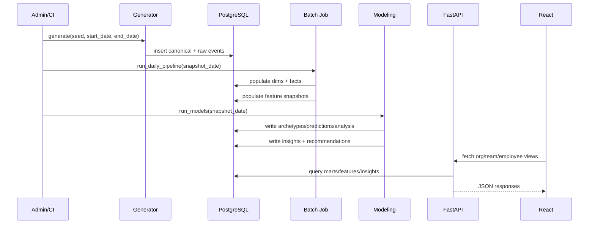

# Work Signal Intelligence Platform MVP Sprint Plan

## Executive summary

The **Work Signal Intelligence Platform (WSIP)** MVP is a backend-first, full‑stack analytics product that turns heterogeneous “work signals” (code, research, docs, execution, collaboration, skills, and org context) into **decision-support** insights: underutilization, overload/burnout risk, disengagement risk, skill utilization, and “glue” signals that identify connective contributors.

This sprint plan is designed for an MVP built with **FastAPI** (API layer), **PostgreSQL** (system of record + marts), **SQLAlchemy ORM** (domain model), synthetic data generation (to avoid real employee data in the MVP), modeling (archetypes, trajectories, causal pre/post, simulation), and a **React** frontend built with a modern build tool (Vite). FastAPI’s automatic OpenAPI-based docs (Swagger UI/ ReDoc) make the backend self-documenting during development. citeturn0search0turn6search2turn6search6

Sprints are intentionally **backend-heavy first**, then frontend, because WSIP’s core value depends on the schema, synthetic data, derived marts, and metrics being correct and stable before the UI is built.

Key MVP outcomes at completion:
- “One command” local bring-up using Docker Compose for backend + DB. citeturn2search0turn2search4
- A reproducible synthetic dataset (seeded) spanning ~365 days across ~300 employees, teams, and projects.
- Layered architecture implemented end-to-end: raw events → canonical model → marts → feature store → insights/recommendations.
- RBAC + audit logging for sensitive individual drill-down views, aligned with privacy and logging best practices (data minimization, purpose limitation, audit logging content). citeturn5search1turn5search9turn5search0turn5search3
- React UI with five pages: org overview, team view, employee profile (RBAC gated), recommendations, simulation sandbox.

## MVP scope and phased roadmap

### Product intent and guardrails

WSIP is built to answer “alignment and utilization” questions without turning into surveillance. The MVP is explicitly constrained to **metadata signals** (counts, timestamps, relationships), not message content or keystrokes.

Privacy and ethics principles that shape scope:
- **Data minimization**: only collect/process data necessary for WSIP objectives. citeturn5search1turn5search13
- **Purpose limitation**: define and document purposes up front; do not reuse signals for incompatible purposes. citeturn5search9turn5search5
- **Auditability**: sensitive access is logged with who/what/when/outcome. citeturn5search3turn5search7

### MVP capabilities

In scope for MVP:
- Canonical schema to model employees/teams/org/projects, artifacts, interactions, skills, and assignments.
- Raw event tables covering: code/PR/review, experiments, docs, tasks, meetings metadata, chat metadata, skills/training signals.
- Analytics marts (facts/dims) + feature store with rolling window features (7/30/90 days).
- Five core metrics:
  - **Underutilization**
  - **Overload**
  - **Disengagement risk**
  - **Skill utilization**
  - **Glue person score**
- Insight engine v1 (mostly rule-based thresholds with explainability) and model outputs:
  - archetype clustering
  - trajectory predictions (baseline models)
  - pre/post change analysis
  - scenario simulation engine
- Secure individual filter: optional employee drill-down controlled by RBAC + per-access audit logging.

Out of scope for MVP (explicit non-goals):
- Real connectors to Git hosting, HRIS, Slack/Teams, calendar systems.
- Any collection of message content, document contents, audio transcripts, or keystrokes.
- Automated performance ratings, “ranking employees,” or disciplinary tooling.
- Complex streaming ingestion/event bus.

### Phased roadmap

| Phase | Summary | Primary artifacts | Related sprints |
|---|---|---|---|
| Backend core | Schema + migrations, API skeleton, raw ingestion + synthetic generator | Postgres DDL, SQLAlchemy models, synthetic generator v1, ingestion endpoints | S1–S3 |
| Derived analytics | Marts, feature store, metric computation, RBAC + audit | fact tables, feature snapshots, metric SQL, access control | S3–S5 |
| Productization | Insight engine, modeling v1, stable APIs, docs | insights/recommendations, archetypes, simulation engine, OpenAPI docs | S5–S6 |
| Frontend | React UI + integration | five pages, API client, RBAC-aware UI | S7–S9 |

## Layered architecture and data flow

### Layer definitions

WSIP is implemented as a deliberate pipeline with five layers:

1. **Raw events**: immutable, append-friendly tables representing atomic events (e.g., “commit happened,” “experiment completed,” “meeting attended”).
2. **Canonical model**: normalized entities and relationships (employees, projects, skills, artifacts, interactions).
3. **Analytics marts**: dimensional facts/dims optimized for dashboard queries (daily activity, project contributions, weekly team health).
4. **Feature store**: model-ready rolling window features snapshots per employee/date.
5. **Insight engine**: derived flags, recommendations, and model outputs written back to tables.

PostgreSQL supports rich data types (including `jsonb`) that help store flexible metadata when it is not worth normalizing in the MVP. citeturn0search2turn0search14

FastAPI uses Python type hints and OpenAPI to generate interactive API docs by default (Swagger UI and ReDoc), which accelerates MVP iteration. citeturn6search2turn6search6

### High-level data flow diagram

```mermaid
flowchart LR
  subgraph Gen[Synthetic Generation]
    SEED[Seed + Personas] --> RAWINS[Insert Raw Events]
    SEED --> CANONINS[Insert Canonical Entities]
  end

  subgraph Raw[Raw Events Layer]
    RAW1[code/pr/review]
    RAW2[experiments]
    RAW3[docs/tasks]
    RAW4[meetings/chat]
    RAW5[training/skills]
  end

  subgraph Canon[Canonical Model]
    EMP[employees/teams/orgs]
    PRJ[projects/assignments]
    ART[artifacts/contributions]
    INT[interactions graph]
    SK[skills]
  end

  subgraph Mart[Analytics Marts]
    FACT1[fact_employee_daily_activity]
    FACT2[fact_employee_project_contribution]
    FACT3[fact_team_weekly_health]
    DIM[dim_*]
  end

  subgraph Feat[Feature Store]
    FS[employee_feature_snapshots]
  end

  subgraph Model[Model + Insight]
    AR[archetypes]
    TR[trajectory preds]
    CA[pre/post analysis]
    SIM[simulation outcomes]
    INS[insights + recommendations]
  end

  subgraph Serve[Serving]
    API[FastAPI]
    UI[React]
  end

  RAWINS --> Raw
  CANONINS --> Canon
  Raw --> Mart
  Canon --> Mart
  Mart --> Feat
  Feat --> Model
  Model --> Serve
  API --> UI
```



Mermaid diagrams are defined using Markdown-like syntax and can render flowcharts and sequence diagrams. citeturn2search5turn2search9

### Batch orchestration sequence



PostgreSQL window functions make rolling windows and “lag/lead” comparisons practical directly within SQL. citeturn4search0turn4search4

## Full schema and data models

### Global conventions used in this plan

- **IDs**: `UUID` primary keys for almost all entities; foreign keys reference the same.
- **Event timestamps**: `TIMESTAMPTZ` (`timestamp with time zone`) for event time.
- **Snapshots**: `DATE` columns like `snapshot_date` for derived tables.
- **Scores**: `NUMERIC(10,4)` for stable scoring and probabilities.
- **Flexible metadata**: `JSONB` for occasional non-critical metadata fields. citeturn0search2
- **Audit columns**: `created_at`, `updated_at` where the row is mutable.
- **Indexes**: event tables index `(employee_id, ts)` and/or `(project_id, ts)` to support rolling window queries.

Postgres constraints and foreign keys maintain referential integrity between related tables. citeturn4search9turn4search5

Below, each table includes: purpose, columns, why, and example values. (For readability, “why” is short but explicit.)

### Canonical core tables

#### `orgs`

Purpose: model a stable organization hierarchy (VP org / group / department).

| Column | Type | Why it exists | Example |
|---|---|---|---|
| org_id | UUID (PK) | stable identifier | `8f9c...` |
| org_name | TEXT | display + grouping | `Core Research` |
| parent_org_id | UUID (FK→orgs.org_id, null) | hierarchy rolling up | `null` |
| created_at | TIMESTAMPTZ | audit and lineage | `2026-04-06T10:00:00Z` |

#### `teams`

Purpose: teams are the primary operational unit for managers and staffing.

| Column | Type | Why it exists | Example |
|---|---|---|---|
| team_id | UUID (PK) | stable identifier | `0a12...` |
| team_name | TEXT | display + filtering | `Inference Systems` |
| parent_team_id | UUID (FK→teams.team_id, null) | hierarchical rollups | `null` |
| org_id | UUID (FK→orgs.org_id) | team belongs to org | `8f9c...` |
| function_type | TEXT | role expectations differ by function | `engineering` |
| mission_area | TEXT | topic grouping | `serving` |
| leader_employee_id | UUID (FK→employees.employee_id, null) | org charts + manager views | `d3aa...` |
| created_at | TIMESTAMPTZ | audit | `2026-04-06T10:00:00Z` |
| updated_at | TIMESTAMPTZ | audit | `2026-04-06T10:00:00Z` |

#### `employees`

Purpose: canonical person record for aggregation, baselines, RBAC.

| Column | Type | Why it exists | Example |
|---|---|---|---|
| employee_id | UUID (PK) | stable identifier | `d3aa...` |
| external_employee_ref | TEXT (unique) | placeholder to match HRIS later | `E-00123` |
| full_name | TEXT | display | `Ava Chen` |
| preferred_name | TEXT (null) | display preference | `Ava` |
| email | TEXT | login mapping | `ava@example.com` |
| role_title | TEXT | “expected signal profile” | `Research Scientist` |
| role_family | TEXT | baseline cohorts | `research` |
| job_level | TEXT | baseline cohorts | `L5` |
| employment_status | TEXT | hide inactive by default | `active` |
| manager_employee_id | UUID (FK→employees.employee_id, null) | reporting chain | `b1f0...` |
| team_id | UUID (FK→teams.team_id) | default grouping | `0a12...` |
| org_id | UUID (FK→orgs.org_id) | rollup | `8f9c...` |
| location | TEXT | time zone/geo grouping | `London` |
| hire_date | DATE | tenure calculations | `2023-09-18` |
| exit_date | DATE (null) | churn labels | `null` |
| compensation_band | TEXT (null) | sensitivity; used only for cohorts | `Band-C` |
| clearance_tier | TEXT (null) | optional, for restricted projects | `Tier-2` |
| created_at | TIMESTAMPTZ | audit | `2026-04-06T10:00:00Z` |
| updated_at | TIMESTAMPTZ | audit | `2026-04-06T10:00:00Z` |

#### `repos`

Purpose: repository dimension for code events; improves realism over “free text repo_id”.

| Column | Type | Why it exists | Example |
|---|---|---|---|
| repo_id | UUID (PK) | stable identifier | `0db2...` |
| source_system | TEXT | future connector mapping | `gitlab` |
| repo_name | TEXT | display | `model-serving` |
| owning_team_id | UUID (FK→teams.team_id, null) | ownership rollups | `0a12...` |
| is_monorepo | BOOLEAN | affects expected counts | `false` |
| created_at | TIMESTAMPTZ | audit | `2026-04-06T10:00:00Z` |

#### `projects`

Purpose: projects are the unit for staffing, impact attribution, and simulation.

| Column | Type | Why it exists | Example |
|---|---|---|---|
| project_id | UUID (PK) | stable identifier | `f210...` |
| project_name | TEXT | display | `Reranker v2` |
| project_type | TEXT | affects expected signals | `research` |
| priority_tier | TEXT | weighting for utilization/impact | `high` |
| status | TEXT | filter out completed | `active` |
| owner_employee_id | UUID (FK→employees.employee_id, null) | accountability | `d3aa...` |
| owning_team_id | UUID (FK→teams.team_id) | rollups | `0a12...` |
| strategic_area | TEXT | grouping | `ranking` |
| start_date | DATE | time filtering | `2026-01-10` |
| target_end_date | DATE (null) | schedule context | `2026-10-31` |
| created_at | TIMESTAMPTZ | audit | `2026-04-06T10:00:00Z` |
| updated_at | TIMESTAMPTZ | audit | `2026-04-06T10:00:00Z` |

#### `employee_project_assignments`

Purpose: capture who is “supposed” to be working where; enables utilization vs allocation.

| Column | Type | Why it exists | Example |
|---|---|---|---|
| assignment_id | UUID (PK) | stable row identity | `9a77...` |
| employee_id | UUID (FK→employees.employee_id) | who is assigned | `d3aa...` |
| project_id | UUID (FK→projects.project_id) | what they work on | `f210...` |
| assignment_role | TEXT | expected contribution shape | `contributor` |
| allocation_pct | NUMERIC(5,2) | expected utilization | `50.00` |
| start_date | DATE | staffing over time | `2026-02-01` |
| end_date | DATE (null) | staffing over time | `null` |
| staffing_source | TEXT | explains allocation | `manager_assigned` |
| created_at | TIMESTAMPTZ | audit | `2026-04-06T10:00:00Z` |

#### `skills`

Purpose: skill taxonomy for capability and matching.

| Column | Type | Why it exists | Example |
|---|---|---|---|
| skill_id | UUID (PK) | stable identifier | `c8b1...` |
| skill_name | TEXT | display | `reinforcement learning` |
| skill_category | TEXT | grouping | `ml` |
| parent_skill_id | UUID (FK→skills.skill_id, null) | taxonomy | `null` |

#### `employee_skills`

Purpose: represent current skill profile with confidence and provenance.

| Column | Type | Why it exists | Example |
|---|---|---|---|
| employee_skill_id | UUID (PK) | stable row identity | `e91c...` |
| employee_id | UUID (FK→employees.employee_id) | owner | `d3aa...` |
| skill_id | UUID (FK→skills.skill_id) | which skill | `c8b1...` |
| proficiency_level | TEXT | expected utilization fit | `advanced` |
| evidence_type | TEXT | trust/triage | `artifact_inferred` |
| confidence_score | NUMERIC(5,4) | weighting in match | `0.7800` |
| valid_from | DATE | skills evolve | `2025-09-01` |
| valid_to | DATE (null) | sunset outdated skills | `null` |

#### `project_skill_requirements`

Purpose: “what skills project needs” for matching and skill utilization.

| Column | Type | Why it exists | Example |
|---|---|---|---|
| project_skill_req_id | UUID (PK) | stable row identity | `aa11...` |
| project_id | UUID (FK→projects.project_id) | which project | `f210...` |
| skill_id | UUID (FK→skills.skill_id) | required skill | `c8b1...` |
| desired_level | TEXT | role matching | `advanced` |
| weight | NUMERIC(6,4) | importance for matching | `0.2500` |
| created_at | TIMESTAMPTZ | audit | `2026-04-06T10:00:00Z` |

#### `artifacts`

Purpose: universal “work objects” (PRs, docs, tasks, experiments, papers).

| Column | Type | Why it exists | Example |
|---|---|---|---|
| artifact_id | UUID (PK) | stable identifier | `7f21...` |
| artifact_type | TEXT | aggregation category | `pull_request` |
| source_system | TEXT | connector mapping | `gitlab` |
| source_artifact_ref | TEXT | external reference | `PR-481` |
| title | TEXT (null) | display | `Improve sampler` |
| description | TEXT (null) | optional | `refactor + tests` |
| created_by_employee_id | UUID (FK→employees.employee_id, null) | provenance | `d3aa...` |
| owning_team_id | UUID (FK→teams.team_id, null) | ownership | `0a12...` |
| project_id | UUID (FK→projects.project_id, null) | attribution | `f210...` |
| created_at | TIMESTAMPTZ | artifact lifecycle | `2026-03-01T12:00:00Z` |
| updated_at | TIMESTAMPTZ | artifact lifecycle | `2026-03-03T18:00:00Z` |

#### `artifact_contributions`

Purpose: “who contributed how to which artifact” for attribution and influence.

| Column | Type | Why it exists | Example |
|---|---|---|---|
| contribution_id | UUID (PK) | stable identifier | `b77c...` |
| artifact_id | UUID (FK→artifacts.artifact_id) | target artifact | `7f21...` |
| employee_id | UUID (FK→employees.employee_id) | contributor | `d3aa...` |
| contribution_type | TEXT | author/reviewer/editor | `reviewer` |
| contribution_weight | NUMERIC(8,4) | splitting credit | `0.2000` |
| contribution_ts | TIMESTAMPTZ | time-series attribution | `2026-03-02T09:00:00Z` |

#### `artifact_skill_tags`

Purpose: lightweight mapping from artifacts to skills, enabling skill utilization inference.

| Column | Type | Why it exists | Example |
|---|---|---|---|
| artifact_skill_tag_id | UUID (PK) | stable identifier | `c1d2...` |
| artifact_id | UUID (FK→artifacts.artifact_id) | tagged artifact | `7f21...` |
| skill_id | UUID (FK→skills.skill_id) | implied skill | `c8b1...` |
| tag_source | TEXT | provenance | `generator` |
| confidence_score | NUMERIC(5,4) | weighting | `0.6500` |
| created_at | TIMESTAMPTZ | audit | `2026-04-06T10:00:00Z` |

#### `interactions`

Purpose: universal collaboration edges for org network analysis and “glue” metrics.

| Column | Type | Why it exists | Example |
|---|---|---|---|
| interaction_id | UUID (PK) | stable identifier | `119a...` |
| interaction_type | TEXT | meeting/chat/review/comment | `code_review` |
| source_system | TEXT | connector mapping | `gitlab` |
| from_employee_id | UUID (FK→employees.employee_id) | sender/actor | `d3aa...` |
| to_employee_id | UUID (FK→employees.employee_id) | receiver | `b1f0...` |
| project_id | UUID (FK→projects.project_id, null) | context | `f210...` |
| artifact_id | UUID (FK→artifacts.artifact_id, null) | context | `7f21...` |
| interaction_ts | TIMESTAMPTZ | time windowing | `2026-03-02T09:00:00Z` |
| interaction_weight | NUMERIC(8,4) | strength of edge | `1.0000` |
| metadata_json | JSONB | optional details without content | `{"turnaround_min": 35}` |

`jsonb` supports stored structured metadata and querying operators. citeturn0search2turn0search6

#### `employee_snapshots`

Purpose: slowly changing employee attributes for historical comparisons.

| Column | Type | Why it exists | Example |
|---|---|---|---|
| snapshot_id | UUID (PK) | stable row identity | `0f0a...` |
| employee_id | UUID (FK→employees.employee_id) | owner | `d3aa...` |
| snapshot_date | DATE | “as of” date | `2026-04-01` |
| role_title | TEXT | cohort | `Research Scientist` |
| role_family | TEXT | cohort | `research` |
| job_level | TEXT | cohort | `L5` |
| manager_employee_id | UUID (null) | history | `b1f0...` |
| team_id | UUID | history | `0a12...` |
| org_id | UUID | history | `8f9c...` |
| performance_rating | TEXT (null) | optional labelization | `exceeds` |
| promotion_readiness | TEXT (null) | modeling target | `ready` |
| flight_risk_flag | BOOLEAN (null) | optional attr for synthetic labeling; exclude or gate in real deployments | `false` |
| tenure_days | INT | baseline segmentation | `945` |
| compensation_band | TEXT (null) | cohort only | `Band-C` |

#### `employee_change_events`

Purpose: capture “interventions” like manager change or project reassignment for causal pre/post analyses.

| Column | Type | Why it exists | Example |
|---|---|---|---|
| change_event_id | UUID (PK) | stable identifier | `7712...` |
| employee_id | UUID (FK→employees.employee_id) | who changed | `d3aa...` |
| change_type | TEXT | event category | `project_reassignment` |
| event_date | DATE | analysis anchor | `2026-03-15` |
| from_value | TEXT (null) | pre state | `Project A` |
| to_value | TEXT (null) | post state | `Project B` |
| created_at | TIMESTAMPTZ | audit | `2026-03-15T18:00:00Z` |

#### `data_generation_runs`

Purpose: reproducible synthetic dataset configuration and lineage.

| Column | Type | Why it exists | Example |
|---|---|---|---|
| run_id | UUID (PK) | stable identifier | `b0c1...` |
| seed | BIGINT | reproducibility | `20260406` |
| start_date | DATE | data horizon | `2025-04-07` |
| end_date | DATE | data horizon | `2026-04-06` |
| employee_count | INT | dataset shape | `300` |
| notes_json | JSONB | parameters/personas | `{"personas": 10}` |
| created_at | TIMESTAMPTZ | audit | `2026-04-06T10:00:00Z` |

### RBAC and auditability tables

FastAPI provides OAuth2 helpers (Password flow + Bearer token) and JWT patterns in its security tutorial; WSIP uses these patterns to implement authentication and role checks. citeturn2search10turn2search6

#### `app_users`

Purpose: application auth identity (may map to employee or be service account).

| Column | Type | Why it exists | Example |
|---|---|---|---|
| user_id | UUID (PK) | stable identifier | `2b21...` |
| employee_id | UUID (FK→employees.employee_id, null) | link to human | `d3aa...` |
| username | TEXT (unique) | login | `ava` |
| password_hash | TEXT | secure storage | `"$2b$12$..."` |
| is_active | BOOLEAN | disable accounts | `true` |
| created_at | TIMESTAMPTZ | audit | `2026-04-06T10:00:00Z` |

#### `roles`

Purpose: global RBAC roles.

| Column | Type | Why it exists | Example |
|---|---|---|---|
| role_id | UUID (PK) | stable identifier | `8a8f...` |
| role_name | TEXT (unique) | control checks | `manager` |
| description | TEXT | documentation | `Can view team + direct reports` |

#### `user_roles`

Purpose: many-to-many mapping from users to roles.

| Column | Type | Why it exists | Example |
|---|---|---|---|
| user_role_id | UUID (PK) | stable identifier | `e3d1...` |
| user_id | UUID (FK→app_users.user_id) | which user | `2b21...` |
| role_id | UUID (FK→roles.role_id) | which role | `8a8f...` |
| created_at | TIMESTAMPTZ | audit | `2026-04-06T10:00:00Z` |

#### `viewer_permissions`

Purpose: object-level permission grants beyond global roles (team/org/employee scopes).

| Column | Type | Why it exists | Example |
|---|---|---|---|
| permission_id | UUID (PK) | stable identifier | `f10a...` |
| viewer_user_id | UUID (FK→app_users.user_id) | who can view | `2b21...` |
| target_scope | TEXT | org/team/employee | `employee` |
| target_id | UUID | which object | `d3aa...` |
| permission_type | TEXT | view_summary/view_individual | `view_individual` |
| granted_at | TIMESTAMPTZ | audit | `2026-04-06T10:00:00Z` |

#### `access_audit_log`

Purpose: immutable audit trail of sensitive access (employee-level views, exports, simulations).

NIST guidance for audit record content includes what happened, when, where, source, outcome, and identity—WSIP captures these fields. citeturn5search3turn5search7

| Column | Type | Why it exists | Example |
|---|---|---|---|
| audit_id | UUID (PK) | stable identifier | `aa90...` |
| viewer_user_id | UUID | who accessed | `2b21...` |
| accessed_scope | TEXT | what kind of object | `employee` |
| accessed_id | UUID | which object | `d3aa...` |
| access_ts | TIMESTAMPTZ | when | `2026-04-06T18:02:11Z` |
| action | TEXT | read/export/simulate | `read_profile` |
| outcome | TEXT | success/denied | `success` |
| request_id | TEXT (null) | correlation | `req-8f1c` |
| metadata_json | JSONB | optional params | `{"fields": ["metrics"]}` |

OWASP recommends separating audit/transaction logs from security event logging when they serve different purposes; WSIP treats `access_audit_log` as a dedicated audit trail. citeturn5search0turn5search16

### Raw event tables

These are append-friendly event logs. They are fed by synthetic generation in the MVP.

#### `git_commit_events`

| Column | Type | Why it exists | Example |
|---|---|---|---|
| commit_event_id | UUID (PK) | stable identifier | `caa1...` |
| employee_id | UUID (FK→employees.employee_id) | actor | `d3aa...` |
| repo_id | UUID (FK→repos.repo_id) | repo dimension | `0db2...` |
| project_id | UUID (FK→projects.project_id, null) | attribution | `f210...` |
| commit_hash | TEXT | uniqueness; external ref | `a1b2c3` |
| commit_ts | TIMESTAMPTZ | time windowing | `2026-03-02T02:11:00Z` |
| files_changed | INT | impact proxy | `12` |
| lines_added | INT | scale proxy | `340` |
| lines_deleted | INT | scale proxy | `120` |
| complexity_delta | NUMERIC(10,2) (null) | quality proxy | `5.50` |
| commit_type | TEXT (null) | mix analysis | `refactor` |

#### `pull_request_events`

| Column | Type | Why it exists | Example |
|---|---|---|---|
| pr_event_id | UUID (PK) | stable identifier | `0c91...` |
| pr_id | TEXT | cross-event join key | `PR-481` |
| repo_id | UUID | repo dimension | `0db2...` |
| employee_id | UUID | opener | `d3aa...` |
| project_id | UUID (null) | attribution | `f210...` |
| opened_at | TIMESTAMPTZ | lifecycle | `2026-03-01T12:00:00Z` |
| merged_at | TIMESTAMPTZ (null) | lifecycle | `2026-03-03T18:00:00Z` |
| closed_at | TIMESTAMPTZ (null) | lifecycle | `null` |
| review_count | INT | collaboration proxy | `4` |
| comment_count | INT | collaboration proxy | `11` |
| files_changed | INT | scale proxy | `21` |
| additions | INT | scale proxy | `900` |
| deletions | INT | scale proxy | `230` |
| status | TEXT | filtering | `merged` |

#### `code_review_events`

| Column | Type | Why it exists | Example |
|---|---|---|---|
| review_event_id | UUID (PK) | stable identifier | `7bb0...` |
| pr_id | TEXT | join to PR | `PR-481` |
| reviewer_employee_id | UUID | reviewer | `b1f0...` |
| author_employee_id | UUID | author | `d3aa...` |
| review_ts | TIMESTAMPTZ | time windowing | `2026-03-02T09:00:00Z` |
| review_outcome | TEXT | approve/changes/comment | `approve` |
| turnaround_minutes | INT | support latency | `35` |

#### `experiment_run_events`

| Column | Type | Why it exists | Example |
|---|---|---|---|
| experiment_run_id | UUID (PK) | stable identifier | `ee11...` |
| employee_id | UUID | owner/runner | `d3aa...` |
| experiment_id | TEXT | group runs | `exp-rlhf-77` |
| project_id | UUID | attribution | `f210...` |
| started_at | TIMESTAMPTZ | lifecycle | `2026-02-20T08:00:00Z` |
| ended_at | TIMESTAMPTZ (null) | lifecycle | `2026-02-20T19:00:00Z` |
| status | TEXT | success/failed/aborted | `success` |
| compute_hours | NUMERIC(10,2) | cost proxy | `11.25` |
| gpu_hours | NUMERIC(10,2) | cost proxy | `45.00` |
| benchmark_score | NUMERIC(10,4) (null) | outcome proxy | `0.8231` |
| benchmark_delta | NUMERIC(10,4) (null) | improvement proxy | `0.0123` |
| novelty_score | NUMERIC(10,4) (null) | exploration proxy | `0.4100` |
| reproducibility_score | NUMERIC(10,4) (null) | quality proxy | `0.7000` |

#### `research_artifact_events`

| Column | Type | Why it exists | Example |
|---|---|---|---|
| research_artifact_event_id | UUID (PK) | stable identifier | `ad21...` |
| employee_id | UUID | author | `d3aa...` |
| project_id | UUID | attribution | `f210...` |
| artifact_kind | TEXT | paper_draft/model_card/etc | `model_card` |
| created_at | TIMESTAMPTZ | artifact time | `2026-02-25T16:00:00Z` |
| updated_at | TIMESTAMPTZ | artifact time | `2026-03-02T12:00:00Z` |
| collaboration_count | INT | collaboration proxy | `3` |
| downstream_references | INT | influence proxy | `7` |

#### `document_events`

| Column | Type | Why it exists | Example |
|---|---|---|---|
| document_event_id | UUID (PK) | stable identifier | `d0a2...` |
| document_id | TEXT | join key | `doc-993` |
| employee_id | UUID | actor | `d3aa...` |
| project_id | UUID (null) | attribution | `f210...` |
| event_type | TEXT | created/edited/commented | `edited` |
| event_ts | TIMESTAMPTZ | time windowing | `2026-03-04T11:22:00Z` |
| word_count_delta | INT (null) | magnitude proxy | `120` |
| comment_count | INT (null) | collaboration proxy | `2` |
| approval_state | TEXT (null) | governance proxy | `approved` |

#### `task_events`

| Column | Type | Why it exists | Example |
|---|---|---|---|
| task_event_id | UUID (PK) | stable identifier | `a901...` |
| task_id | TEXT | join key | `JIRA-1201` |
| employee_id | UUID | actor/owner | `d3aa...` |
| project_id | UUID (null) | attribution | `f210...` |
| event_type | TEXT | created/blocked/completed | `completed` |
| event_ts | TIMESTAMPTZ | cycle time calc | `2026-03-05T17:00:00Z` |
| task_type | TEXT | segmentation | `research` |
| priority | TEXT | weighting | `P1` |
| estimated_hours | NUMERIC(8,2) (null) | planning variance | `8.00` |
| actual_hours | NUMERIC(8,2) (null) | throughput variance | `10.50` |

#### `meeting_events`

Purpose: store meeting metadata, not content.

| Column | Type | Why it exists | Example |
|---|---|---|---|
| meeting_event_id | UUID (PK) | stable identifier | `b0aa...` |
| meeting_id | TEXT | group events | `mtg-221` |
| employee_id | UUID | attendee | `d3aa...` |
| project_id | UUID (null) | context | `f210...` |
| event_role | TEXT | organizer/attendee/presenter | `presenter` |
| start_ts | TIMESTAMPTZ | time | `2026-03-06T16:00:00Z` |
| duration_minutes | INT | load proxy | `45` |
| attendee_count | INT | meeting scope proxy | `12` |

#### `chat_metadata_events`

Purpose: metadata-only interactions; exclude message text.

| Column | Type | Why it exists | Example |
|---|---|---|---|
| chat_event_id | UUID (PK) | stable identifier | `11b2...` |
| employee_id | UUID | actor | `d3aa...` |
| channel_id | TEXT | grouping | `chan-ml` |
| thread_id | TEXT (null) | thread grouping | `thr-9` |
| event_type | TEXT | message/reply/mention | `reply_sent` |
| counterpart_employee_id | UUID (null) | interaction partner | `b1f0...` |
| event_ts | TIMESTAMPTZ | time | `2026-03-06T16:10:00Z` |
| response_latency_minutes | INT (null) | responsiveness proxy | `14` |

#### `training_completion_events`

Purpose: explicit skill acquisition signals.

| Column | Type | Why it exists | Example |
|---|---|---|---|
| training_event_id | UUID (PK) | stable identifier | `f1a1...` |
| employee_id | UUID | who trained | `d3aa...` |
| training_name | TEXT | display | `Secure ML Systems` |
| skill_id | UUID (null) | link to taxonomy | `c8b1...` |
| completed_at | TIMESTAMPTZ | timeline | `2026-01-12T18:00:00Z` |
| certification_flag | BOOLEAN | strength of signal | `true` |

#### `resume_skill_inference`

Purpose: inferred skills from resumes or historical artifacts; in MVP, generator creates this.

| Column | Type | Why it exists | Example |
|---|---|---|---|
| inference_id | UUID (PK) | stable identifier | `0d10...` |
| employee_id | UUID | who inferred | `d3aa...` |
| skill_id | UUID | inferred skill | `c8b1...` |
| inferred_strength | NUMERIC(5,4) | weighting | `0.7200` |
| source | TEXT | provenance | `resume` |
| inference_ts | TIMESTAMPTZ | timeline | `2026-04-06T10:00:00Z` |

### Analytics marts (dims + facts)

These tables are derived and (re)buildable by batch pipelines.

#### `dim_date`

Purpose: calendar keys for facts.

| Column | Type | Why it exists | Example |
|---|---|---|---|
| date_key | INT (PK) | join key (YYYYMMDD) | `20260306` |
| date | DATE | human readability | `2026-03-06` |
| day_of_week | INT | seasonality | `5` |
| is_weekend | BOOLEAN | filters | `false` |
| week_key | INT | weekly facts | `202610` |
| month_key | INT | monthly grouping | `202603` |

#### `dim_employee`

Purpose: SCD dimension for employee attributes used in facts.

| Column | Type | Why it exists | Example |
|---|---|---|---|
| employee_key | BIGSERIAL (PK) | surrogate join key | `1011` |
| employee_id | UUID | natural key | `d3aa...` |
| role_family | TEXT | cohorting | `research` |
| job_level | TEXT | cohorting | `L5` |
| team_id | UUID | rollup | `0a12...` |
| org_id | UUID | rollup | `8f9c...` |
| is_active | BOOLEAN | filtering | `true` |
| effective_from | DATE | SCD range | `2026-01-01` |
| effective_to | DATE | SCD range | `9999-12-31` |

#### `dim_team`

Purpose: team dimension for facts; captures slow changes (e.g., rename, reorg) with effective date ranges.

| Column | Type | Why it exists | Example |
|---|---|---|---|
| team_key | BIGSERIAL (PK) | surrogate join key | `501` |
| team_id | UUID | natural key | `0a12...` |
| team_name | TEXT | display | `Inference Systems` |
| org_id | UUID | rollup | `8f9c...` |
| function_type | TEXT | cohorting | `engineering` |
| mission_area | TEXT | grouping | `serving` |
| effective_from | DATE | SCD range start | `2026-01-01` |
| effective_to | DATE | SCD range end | `9999-12-31` |

#### `dim_project`

Purpose: project dimension for facts; supports filtering by type/priority over time.

| Column | Type | Why it exists | Example |
|---|---|---|---|
| project_key | BIGSERIAL (PK) | surrogate join key | `901` |
| project_id | UUID | natural key | `f210...` |
| project_name | TEXT | display | `Reranker v2` |
| project_type | TEXT | cohorting | `research` |
| priority_tier | TEXT | weighting/filters | `high` |
| status | TEXT | filtering | `active` |
| owning_team_id | UUID | rollup | `0a12...` |
| strategic_area | TEXT | grouping | `ranking` |
| effective_from | DATE | SCD range start | `2026-01-10` |
| effective_to | DATE | SCD range end | `9999-12-31` |

#### `dim_skill`

Purpose: skill dimension for skill facts; stable taxonomy with optional hierarchy.

| Column | Type | Why it exists | Example |
|---|---|---|---|
| skill_key | BIGSERIAL (PK) | surrogate join key | `44` |
| skill_id | UUID | natural key | `c8b1...` |
| skill_name | TEXT | display | `reinforcement learning` |
| skill_category | TEXT | grouping | `ml` |
| parent_skill_id | UUID (null) | hierarchy | `null` |
| effective_from | DATE | taxonomy versioning | `2026-01-01` |
| effective_to | DATE | taxonomy versioning | `9999-12-31` |

#### `fact_employee_daily_activity`

Purpose: daily aggregation of heterogeneous work signals (the core dashboard fact).

| Column | Type | Why it exists | Example |
|---|---|---|---|
| date_key | INT (PK part) | daily grain | `20260306` |
| employee_key | BIGINT (PK part) | join to dim_employee | `1011` |
| team_id | UUID | rollup without extra join | `0a12...` |
| org_id | UUID | rollup | `8f9c...` |
| commits_count | INT | code volume | `3` |
| prs_opened_count | INT | code throughput | `1` |
| prs_merged_count | INT | outcome | `1` |
| code_reviews_given_count | INT | collaboration | `2` |
| code_reviews_received_count | INT | collaboration | `1` |
| docs_created_count | INT | knowledge | `0` |
| docs_edited_count | INT | knowledge | `2` |
| tasks_completed_count | INT | execution | `2` |
| tasks_blocked_count | INT | friction | `0` |
| meetings_attended_count | INT | load | `4` |
| meeting_minutes_total | INT | load | `180` |
| chat_messages_sent_count | INT | comms | `8` |
| chat_replies_sent_count | INT | comms | `5` |
| experiments_started_count | INT | research | `1` |
| experiments_completed_count | INT | research | `0` |
| experiment_gpu_hours_total | NUMERIC(10,2) | cost proxy | `12.50` |
| research_artifacts_created | INT | research output | `0` |
| collaboration_edges_count | INT | network breadth proxy | `6` |
| active_projects_count | INT | context for utilization | `2` |

#### `fact_employee_project_contribution`

Purpose: attributed contribution units by project, per day.

| Column | Type | Why it exists | Example |
|---|---|---|---|
| date_key | INT (PK part) | daily grain | `20260306` |
| employee_key | BIGINT (PK part) | join key | `1011` |
| project_id | UUID (PK part) | project grain | `f210...` |
| contribution_units | NUMERIC(12,4) | unified score | `8.2500` |
| code_units | NUMERIC(12,4) | breakdown | `3.1000` |
| research_units | NUMERIC(12,4) | breakdown | `2.5000` |
| documentation_units | NUMERIC(12,4) | breakdown | `1.2000` |
| collaboration_units | NUMERIC(12,4) | breakdown | `1.0000` |
| strategic_units | NUMERIC(12,4) | breakdown | `0.4500` |
| impact_units | NUMERIC(12,4) | outcome proxy | `0.8500` |

#### `fact_team_weekly_health`

Purpose: team-level weekly rollups for leadership.

| Column | Type | Why it exists | Example |
|---|---|---|---|
| week_key | INT (PK part) | weekly grain | `202610` |
| team_id | UUID (PK part) | team grain | `0a12...` |
| active_employee_count | INT | denominator | `22` |
| total_contribution_units | NUMERIC(12,4) | team output | `820.2500` |
| avg_collaboration_centrality | NUMERIC(10,4) | glue proxy | `0.1023` |
| underutilization_rate | NUMERIC(10,4) | risk | `0.0900` |
| overload_rate | NUMERIC(10,4) | risk | `0.1400` |
| silent_disengagement_rate | NUMERIC(10,4) | risk | `0.0500` |
| cross_team_collaboration_rate | NUMERIC(10,4) | silos | `0.2200` |
| project_duplication_risk | NUMERIC(10,4) | overlap heuristic | `0.1800` |
| burnout_risk_rate | NUMERIC(10,4) | load heuristic | `0.0700` |
| mobility_opportunity_rate | NUMERIC(10,4) | underused skill | `0.0400` |

#### `fact_employee_skill_signal`

Purpose: skill scoring and utilization flags per employee per skill.

| Column | Type | Why it exists | Example |
|---|---|---|---|
| date_key | INT (PK part) | time grain | `20260306` |
| employee_key | BIGINT (PK part) | join | `1011` |
| skill_id | UUID (PK part) | which skill | `c8b1...` |
| explicit_skill_score | NUMERIC(10,4) | from training/self report | `0.7000` |
| inferred_skill_score | NUMERIC(10,4) | from artifacts | `0.6500` |
| utilization_score | NUMERIC(10,4) | overlap with work | `0.2000` |
| underused_skill_flag | BOOLEAN | alerting | `true` |

### Feature store and insight/model output tables

#### `employee_feature_snapshots`

Purpose: one row per employee per snapshot date with rolling window and comparative features; used by dashboards and models.

| Column | Type | Why it exists | Example |
|---|---|---|---|
| feature_snapshot_id | UUID (PK) | stable identifier | `ff10...` |
| employee_id | UUID | natural key | `d3aa...` |
| snapshot_date | DATE | feature time | `2026-03-06` |
| commits_30d | INT | rolling feature | `68` |
| commits_30d_vs_self_baseline | NUMERIC(10,4) | drop detection | `-0.2500` |
| commits_30d_vs_role_baseline | NUMERIC(10,4) | cohort compare | `0.1200` |
| prs_merged_30d | INT | throughput | `12` |
| review_participation_30d | NUMERIC(10,4) | collaboration rate | `0.6500` |
| doc_contribution_30d | NUMERIC(10,4) | knowledge | `0.4200` |
| task_completion_rate_30d | NUMERIC(10,4) | execution | `0.7800` |
| task_cycle_time_median_30d | NUMERIC(10,4) | efficiency | `3.2000` |
| experiment_runs_30d | INT | research | `9` |
| experiment_success_rate_30d | NUMERIC(10,4) | stability | `0.7200` |
| benchmark_improvement_avg_30d | NUMERIC(10,4) | outcome | `0.0042` |
| research_artifacts_30d | INT | output | `1` |
| meeting_load_hours_30d | NUMERIC(10,2) | overload | `42.50` |
| collaboration_breadth_30d | INT | network breadth | `18` |
| collaboration_centrality_30d | NUMERIC(10,4) | glue | `0.1023` |
| cross_team_interaction_rate_30d | NUMERIC(10,4) | silos | `0.3100` |
| role_expected_signal_fit | NUMERIC(10,4) | role-respecting baselines | `0.8500` |
| project_allocation_utilization_score | NUMERIC(10,4) | allocation vs output | `0.6000` |
| skill_utilization_score | NUMERIC(10,4) | skill overlap | `0.4000` |
| strategic_influence_score | NUMERIC(10,4) | decision/approval proxy | `0.2200` |
| execution_reliability_score | NUMERIC(10,4) | task completion / reopen | `0.7800` |
| knowledge_creation_score | NUMERIC(10,4) | docs influence | `0.4200` |
| glue_person_score | NUMERIC(10,4) | network glue | `0.6400` |
| activity_drop_14d | NUMERIC(10,4) | early warning | `0.1200` |
| activity_drop_30d | NUMERIC(10,4) | early warning | `0.2500` |
| volatility_score_30d | NUMERIC(10,4) | burstiness | `0.3300` |
| underutilization_score | NUMERIC(10,4) | core metric | `0.7200` |
| overload_score | NUMERIC(10,4) | core metric | `0.4100` |
| disengagement_risk_score | NUMERIC(10,4) | core metric | `0.2800` |
| promotion_readiness_score | NUMERIC(10,4) | optional | `0.3000` |
| internal_mobility_fit_score | NUMERIC(10,4) | skill-to-project matching | `0.6200` |
| model_version | TEXT | reproducibility | `wsip-0.1` |

#### `insights`

Purpose: human-readable, explainable flags derived from features/models.

| Column | Type | Why it exists | Example |
|---|---|---|---|
| insight_id | UUID (PK) | stable identifier | `aa12...` |
| insight_scope | TEXT | org/team/employee/project | `employee` |
| scope_id | UUID | which object | `d3aa...` |
| insight_type | TEXT | underutilization/overload/etc | `underutilization` |
| severity | TEXT | triage | `high` |
| insight_title | TEXT | UI heading | `Underutilization vs allocation` |
| insight_description | TEXT | explanation | `30d activity is -25% vs baseline and allocation is 80%` |
| detected_at | TIMESTAMPTZ | freshness | `2026-04-06T10:02:00Z` |
| valid_until | TIMESTAMPTZ (null) | expiration | `null` |
| confidence_score | NUMERIC(10,4) | trust | `0.7000` |
| model_version | TEXT | lineage | `wsip-0.1` |

#### `recommendations`

Purpose: suggested actions linked to insights (e.g., manager check-in, reassignment candidates).

| Column | Type | Why it exists | Example |
|---|---|---|---|
| recommendation_id | UUID (PK) | stable identifier | `bb91...` |
| insight_id | UUID (FK→insights.insight_id) | explanation anchor | `aa12...` |
| recommendation_type | TEXT | action category | `manager_checkin` |
| target_scope | TEXT | employee/manager/hrbp | `manager` |
| target_id | UUID | who should act | `b1f0...` |
| recommendation_text | TEXT | UI text | `Schedule a 1:1 to confirm priorities and unblock` |
| priority_score | NUMERIC(10,4) | ordering | `0.8500` |
| created_at | TIMESTAMPTZ | audit | `2026-04-06T10:02:00Z` |
| accepted_flag | BOOLEAN (null) | feedback loop | `null` |
| accepted_at | TIMESTAMPTZ (null) | feedback loop | `null` |

#### `employee_archetype_assignments`

Purpose: clustering-based “contribution archetypes” for segmentation.

| Column | Type | Why it exists | Example |
|---|---|---|---|
| assignment_id | UUID (PK) | stable identifier | `1a20...` |
| employee_id | UUID | who | `d3aa...` |
| snapshot_date | DATE | when | `2026-04-06` |
| archetype_label | TEXT | cluster name | `deep_researcher` |
| archetype_confidence | NUMERIC(10,4) | soft assignment | `0.8200` |
| top_signal_1 | TEXT | explainability | `experiment_runs_30d` |
| top_signal_2 | TEXT | explainability | `gpu_hours` |
| top_signal_3 | TEXT | explainability | `benchmark_delta` |
| model_version | TEXT | lineage | `wsip-0.1` |

#### `employee_trajectory_predictions`

Purpose: forward-looking predictions (risk/impact) for planning.

| Column | Type | Why it exists | Example |
|---|---|---|---|
| prediction_id | UUID (PK) | stable identifier | `9f11...` |
| employee_id | UUID | who | `d3aa...` |
| prediction_date | DATE | when predicted | `2026-04-06` |
| horizon_days | INT | horizon | `60` |
| predicted_impact_score | NUMERIC(10,4) | planning | `0.5400` |
| predicted_disengagement_risk | NUMERIC(10,4) | planning | `0.2200` |
| predicted_promotion_readiness | NUMERIC(10,4) | optional | `0.1500` |
| predicted_exit_risk | NUMERIC(10,4) | optional | `0.0800` |
| model_version | TEXT | lineage | `wsip-0.1` |

#### `employee_pre_post_impact_analysis`

Purpose: store pre/post metric deltas around change events.

| Column | Type | Why it exists | Example |
|---|---|---|---|
| analysis_id | UUID (PK) | stable identifier | `cc12...` |
| employee_id | UUID | who | `d3aa...` |
| change_event_id | UUID | anchor | `7712...` |
| metric_name | TEXT | what measured | `activity_score_30d` |
| pre_window_start | DATE | window definition | `2026-02-13` |
| pre_window_end | DATE | window definition | `2026-03-14` |
| post_window_start | DATE | window definition | `2026-03-15` |
| post_window_end | DATE | window definition | `2026-04-14` |
| pre_metric_value | NUMERIC(12,4) | value | `0.7100` |
| post_metric_value | NUMERIC(12,4) | value | `0.5100` |
| delta_value | NUMERIC(12,4) | difference | `-0.2000` |
| causal_confidence | NUMERIC(10,4) (null) | later upgrade | `0.4000` |
| model_version | TEXT | lineage | `wsip-0.1` |

#### `simulation_runs`

Purpose: represent a single “what-if” scenario with assumptions and provenance.

| Column | Type | Why it exists | Example |
|---|---|---|---|
| simulation_run_id | UUID (PK) | stable identifier | `ddee...` |
| scenario_name | TEXT | UI label | `Move 3 people to Project X` |
| scenario_type | TEXT | reallocation/restructuring/hiring | `reallocation` |
| baseline_snapshot_date | DATE | which features/marts were baseline | `2026-04-06` |
| assumptions_json | JSONB | scenario assumptions without schema churn | `{"constraints": "keep_total_headcount"}` |
| created_by_user_id | UUID (FK→app_users.user_id) | accountability | `2b21...` |
| status | TEXT | created/running/completed/failed | `completed` |
| created_at | TIMESTAMPTZ | audit | `2026-04-06T11:00:00Z` |
| completed_at | TIMESTAMPTZ (null) | audit | `2026-04-06T11:00:12Z` |

#### `simulation_employee_moves`

Purpose: define proposed staffing changes within a simulation run.

| Column | Type | Why it exists | Example |
|---|---|---|---|
| simulation_move_id | UUID (PK) | stable identifier | `aa55...` |
| simulation_run_id | UUID (FK→simulation_runs.simulation_run_id) | parent scenario | `ddee...` |
| employee_id | UUID (FK→employees.employee_id) | who moves | `d3aa...` |
| from_team_id | UUID (FK→teams.team_id) | starting team | `0a12...` |
| to_team_id | UUID (FK→teams.team_id) | destination team | `bb20...` |
| from_project_id | UUID (null) | optional project context | `f210...` |
| to_project_id | UUID (null) | optional project context | `c911...` |
| allocation_pct_change | NUMERIC(5,2) | magnitude of move | `+50.00` |
| rationale_text | TEXT (null) | explainability | `Match RL skill to RL project` |
| created_at | TIMESTAMPTZ | audit | `2026-04-06T11:00:02Z` |

#### `simulation_outcomes`

Purpose: store computed deltas for a simulation run, by target scope (team/project/org).

| Column | Type | Why it exists | Example |
|---|---|---|---|
| simulation_outcome_id | UUID (PK) | stable identifier | `bb90...` |
| simulation_run_id | UUID (FK→simulation_runs.simulation_run_id) | parent scenario | `ddee...` |
| target_scope | TEXT | org/team/project | `team` |
| target_id | UUID | which object | `0a12...` |
| expected_underutilization_delta | NUMERIC(10,4) | key KPI change | `-0.0200` |
| expected_overload_delta | NUMERIC(10,4) | key KPI change | `+0.0100` |
| expected_disengagement_delta | NUMERIC(10,4) | key KPI change | `-0.0050` |
| expected_impact_delta | NUMERIC(10,4) | proxy outcome | `+0.0300` |
| expected_collaboration_delta | NUMERIC(10,4) | proxy outcome | `+0.0150` |
| expected_delivery_delta | NUMERIC(10,4) | proxy outcome | `+0.0200` |
| computed_at | TIMESTAMPTZ | freshness | `2026-04-06T11:00:12Z` |
| model_version | TEXT | lineage | `wsip-0.1` |

## Synthetic data generation, feature engineering, and modeling

### Synthetic data generation specification

The generator is intentionally **persona-driven**: employees are created as archetypal “shapes” that produce distinct signal patterns. This ensures dashboards and models have meaningful structure rather than random noise.

#### Personas

| Persona | Description | Characteristic signals |
|---|---|---|
| Deep researcher | high experiment cadence, long cycles | high `experiment_run_events`, moderate docs, lower commits |
| Prolific engineer | high PR throughput, reviews | high commits/PRs, high reviews, moderate meetings |
| Glue person | high cross-team interactions, high reviews, heavy meetings | high `interactions`, high meeting load |
| Underutilized expert | strong skills, weak allocation fit | high skill scores, low output vs allocation |
| Overloaded lead | many meetings + tasks, high context switching | high meeting minutes, many active projects |
| Silent disengagement | normal baseline then sustained drop | activity deltas negative (14/30d) |
| Rising star | accelerating activity + impact proxies | positive deltas, increasing influence |
| Specialist researcher | narrow skills, high benchmark deltas | high benchmark_delta, low breadth |
| Meeting-heavy manager | high meetings, moderate approvals | high meeting minutes, doc approvals |
| New hire ramp | increasing activity over first 90 days | monotonic growth in activity |

#### Distributions and temporal patterns

For realism, use **count distributions** (Poisson/negative binomial) and **heavy-tailed magnitudes** (lognormal) per persona. Events are mostly weekday-weighted; weekends are downweighted.

Temporal patterns to implement:
- Weekday multiplier: Mon–Thu 1.0, Fri 0.8, Sat/Sun 0.1
- “Quarter end” planning spike: docs and meetings up by +20% in the final 10 business days of a quarter
- Release cycle for engineering projects: PRs spike near planned milestones

Shocks to inject (as `employee_change_events` and/or event-rate modifiers):
- Manager change (date D): collaboration breadth drops temporarily, recovery over 30 days
- Project reassignment: allocation changes; utilization changes after a lag
- Burnout episode: meeting load stays high; execution reliability drops
- Research breakthrough: benchmark_delta spikes, followed by higher influence
- Leave of absence: activity goes near zero for a defined interval

#### Minimal sample rows (illustrative)

`employees`

| employee_id | full_name | role_family | job_level | team_id | employment_status |
|---|---|---|---|---|---|
| `d3aa...` | Ava Chen | research | L5 | `0a12...` | active |

`git_commit_events`

| commit_event_id | employee_id | repo_id | commit_ts | files_changed | lines_added | commit_type |
|---|---|---|---|---:|---:|---|
| `caa1...` | `d3aa...` | `0db2...` | `2026-03-02T02:11:00Z` | 12 | 340 | refactor |

`experiment_run_events`

| experiment_run_id | employee_id | project_id | status | gpu_hours | benchmark_delta |
|---|---|---|---|---:|---:|
| `ee11...` | `d3aa...` | `f210...` | success | 45.00 | 0.0123 |

`interactions`

| interaction_id | interaction_type | from_employee_id | to_employee_id | interaction_ts |
|---|---|---|---|---|
| `119a...` | code_review | `b1f0...` | `d3aa...` | `2026-03-02T09:00:00Z` |

### Feature engineering and metric formulas

PostgreSQL window functions enable rolling aggregates and baseline comparisons directly in SQL. citeturn4search0turn4search4

#### Step A: derive daily activity fact

Pseudo-SQL (conceptual):

```sql
-- Build daily rollups per employee per date
INSERT INTO fact_employee_daily_activity (...)
SELECT
  d.date_key,
  e.employee_key,
  de.team_id,
  de.org_id,
  COUNT(DISTINCT gc.commit_event_id) AS commits_count,
  COUNT(DISTINCT pr.pr_event_id) FILTER (WHERE pr.status IS NOT NULL) AS prs_opened_count,
  COUNT(DISTINCT cr.review_event_id) FILTER (WHERE cr.reviewer_employee_id IS NOT NULL) AS code_reviews_given_count,
  COUNT(DISTINCT doc.document_event_id) FILTER (WHERE doc.event_type='created') AS docs_created_count,
  ...
FROM dim_date d
JOIN dim_employee e ON e.effective_from <= d.date AND d.date < e.effective_to
LEFT JOIN git_commit_events gc ON gc.employee_id = e.employee_id AND DATE(gc.commit_ts)=d.date
LEFT JOIN pull_request_events pr ON pr.employee_id = e.employee_id AND DATE(pr.opened_at)=d.date
LEFT JOIN code_review_events cr ON cr.reviewer_employee_id = e.employee_id AND DATE(cr.review_ts)=d.date
LEFT JOIN document_events doc ON doc.employee_id = e.employee_id AND DATE(doc.event_ts)=d.date
...
GROUP BY 1,2,3,4;
```

#### Step B: define a unified activity score (role-aware)

Create a role-aware activity score used in underutilization/disengagement:

```text
activity_score_day =
  w_code(role_family) * f(commits, prs_merged, reviews)
+ w_research(role_family) * f(experiments, gpu_hours, benchmark_delta)
+ w_docs(role_family) * f(docs_created, docs_edited)
+ w_exec(role_family) * f(tasks_completed, task_cycle_time)
+ w_collab(role_family) * f(collaboration_edges, cross_team_rate)
```

Design decision: **weights differ by `role_family`**, preventing “commit bias” against researchers.

#### Rolling windows in SQL

Example 30-day rolling sums with window functions:

```sql
SELECT
  employee_key,
  date_key,
  SUM(commits_count) OVER (
    PARTITION BY employee_key
    ORDER BY date_key
    ROWS BETWEEN 29 PRECEDING AND CURRENT ROW
  ) AS commits_30d
FROM fact_employee_daily_activity;
```

Window functions operate across sets of rows related to the current row and retain row identity. citeturn4search0

#### Core metric formulas

All scores are normalized to 0–1 where possible.

##### Underutilization score

Intent: detect mismatch between expected allocation and observed signals, relative to self and role baselines.

Inputs:
- `activity_drop_30d` (vs self baseline)
- `project_allocation_utilization_score`
- `skill_utilization_score`
- `collaboration_breadth_norm`
- `impact_units_norm` (proxy)

Formula (example weighting):

```text
underutilization_score =
  0.30 * clamp01(activity_drop_30d)
+ 0.25 * clamp01(1 - project_allocation_utilization_score)
+ 0.20 * clamp01(1 - skill_utilization_score)
+ 0.15 * clamp01(1 - collaboration_breadth_norm)
+ 0.10 * clamp01(1 - impact_units_norm)
```

Pseudo-SQL building blocks:

```sql
WITH roll AS (
  SELECT
    employee_id,
    snapshot_date,
    rolling_activity_30d,
    AVG(rolling_activity_30d) OVER (
      PARTITION BY employee_id
      ORDER BY snapshot_date
      ROWS BETWEEN 89 PRECEDING AND 30 PRECEDING
    ) AS baseline_activity_60d
  FROM employee_activity_rollups
),
drops AS (
  SELECT
    employee_id,
    snapshot_date,
    CASE
      WHEN baseline_activity_60d IS NULL OR baseline_activity_60d=0 THEN NULL
      ELSE GREATEST(0, 1 - (rolling_activity_30d / baseline_activity_60d))
    END AS activity_drop_30d
  FROM roll
)
SELECT ... FROM drops;
```

##### Overload score

Intent: approximate overload/burnout risk from load + context switching + volatility.

```text
overload_score =
  0.30 * clamp01(meeting_load_norm)
+ 0.25 * clamp01(active_projects_norm)
+ 0.20 * clamp01(task_load_norm)
+ 0.15 * clamp01(after_hours_activity_norm)
+ 0.10 * clamp01(volatility_score_30d)
```

##### Disengagement risk score

Intent: early warning when multiple signals drop in parallel.

```text
disengagement_risk_score =
  0.35 * clamp01(activity_drop_30d)
+ 0.20 * clamp01(review_participation_drop)
+ 0.15 * clamp01(collaboration_breadth_drop)
+ 0.15 * clamp01(doc_contribution_drop)
+ 0.15 * clamp01(manager_or_project_change_recent_flag)
```

##### Skill utilization score

Compute overlap between employee skills and the skills implied by their current project requirements and artifact skill tags.

Define:
- `employee_top_skills`: top-N skills by confidence
- `work_required_skills`: weighted union of required skills across active assignments
- `artifact_skill_skills`: skills implied by artifacts in last 30 days

Jaccard-style overlap (weighted):

```text
skill_utilization_score =
  weighted_overlap(employee_skills, work_skills) / weighted_union(employee_skills, work_skills)
```

Pseudo-SQL sketch:

```sql
WITH active_assignments AS (
  SELECT employee_id, project_id, allocation_pct
  FROM employee_project_assignments
  WHERE start_date <= :snapshot_date AND (end_date IS NULL OR end_date >= :snapshot_date)
),
required AS (
  SELECT a.employee_id, r.skill_id, SUM(a.allocation_pct * r.weight) AS req_weight
  FROM active_assignments a
  JOIN project_skill_requirements r ON r.project_id = a.project_id
  GROUP BY 1,2
),
emp AS (
  SELECT employee_id, skill_id, confidence_score AS emp_weight
  FROM employee_skills
  WHERE valid_from <= :snapshot_date AND (valid_to IS NULL OR valid_to >= :snapshot_date)
),
overlap AS (
  SELECT
    e.employee_id,
    SUM(LEAST(e.emp_weight, r.req_weight)) AS overlap_weight,
    SUM(GREATEST(e.emp_weight, r.req_weight)) AS union_weight
  FROM emp e
  FULL OUTER JOIN required r
    ON e.employee_id=r.employee_id AND e.skill_id=r.skill_id
  GROUP BY 1
)
SELECT employee_id,
       CASE WHEN union_weight=0 THEN NULL ELSE overlap_weight/union_weight END AS skill_utilization_score
FROM overlap;
```

##### Glue person score

Glue is primarily a network property. The MVP uses NetworkX to compute betweenness centrality and/or related graph metrics. NetworkX defines betweenness centrality in terms of fraction of shortest paths that pass through a node. citeturn3search2

Pipeline:
1. Extract edges from `interactions` for last 30 days (SQL).
2. Build graph in Python.
3. Compute centrality and write to feature snapshots.

Edge extraction SQL:

```sql
SELECT
  from_employee_id AS src,
  to_employee_id AS dst,
  SUM(interaction_weight) AS weight
FROM interactions
WHERE interaction_ts >= (:snapshot_date::date - INTERVAL '30 days')
  AND interaction_ts < (:snapshot_date::date + INTERVAL '1 day')
GROUP BY 1,2;
```

Glue score (normalized) combines:
- betweenness centrality
- cross-team interaction rate
- review support rate
- doc-comment assist proxy

### Modeling tasks for MVP

Clustering and mixture models (KMeans, GaussianMixture) are available in scikit-learn; GaussianMixture provides a probabilistic mixture model representation. citeturn3search0turn3search4turn3search12

Planned model components and MVP approach:

| Component | MVP model type | Key library | Stored outputs |
|---|---|---|---|
| Archetypes | KMeans or GaussianMixture on standardized features | scikit-learn | `employee_archetype_assignments` |
| Trajectories | baseline regression/classification (e.g., logistic for disengagement risk) | scikit-learn | `employee_trajectory_predictions` |
| Causal pre/post | pre/post deltas + optional OLS with controls | statsmodels OLS | `employee_pre_post_impact_analysis` |
| Simulation | deterministic re-weighting + recompute aggregate metrics | pandas + SQL | `simulation_*` tables |

Statsmodels provides OLS regression for linear models and supports time series modules (`statsmodels.tsa`) for later upgrades. citeturn7search0turn7search1

## Backend and frontend implementation plan

### Backend implementation plan

#### Repository structure and service layout

Recommended mono-repo layout:

- `backend/`
  - `app/` (FastAPI)
  - `models/` (SQLAlchemy ORM)
  - `schemas/` (Pydantic response/request models)
  - `etl/` (batch pipelines: marts/features/insights)
  - `synthetic/` (generator)
  - `ml/` (clustering/predictions/graphs/simulation)
  - `tests/`
  - `alembic/`
- `frontend/`
  - `src/` (React app)
  - `tests/`
- `docker-compose.yml`

Docker Compose uses a Compose file to define services, networks, and volumes. citeturn2search0turn2search12

#### Postgres DDL and migrations

Use Alembic for change-managed migrations. Alembic is a migration tool designed to work with SQLAlchemy. citeturn1search0turn1search4

Minimum DB objects:
- schemas (optional): `raw`, `canonical`, `mart`, `features`, `insights`
- tables as listed above
- indexes for time-series tables
- foreign keys for canonical relations

Example DDL snippet (illustrative):

```sql
CREATE TABLE employees (
  employee_id UUID PRIMARY KEY,
  external_employee_ref TEXT UNIQUE NOT NULL,
  full_name TEXT NOT NULL,
  role_family TEXT NOT NULL,
  job_level TEXT NOT NULL,
  team_id UUID NOT NULL REFERENCES teams(team_id),
  org_id UUID NOT NULL REFERENCES orgs(org_id),
  employment_status TEXT NOT NULL,
  created_at TIMESTAMPTZ NOT NULL DEFAULT now(),
  updated_at TIMESTAMPTZ NOT NULL DEFAULT now()
);
CREATE INDEX idx_employees_team ON employees(team_id);
```

PostgreSQL documents constraints and foreign keys as the mechanism for referential integrity. citeturn4search9turn4search5

#### SQLAlchemy ORM models

Use SQLAlchemy 2.x Declarative mapping. SQLAlchemy supports declarative mapping styles including `mapped_column()` constructs and relationship patterns. citeturn2search15turn2search11turn2search7

The `sessionmaker` factory creates new `Session` objects; sessions represent a single transaction and should not be shared concurrently. citeturn6search3turn6search7

Example SQLAlchemy model snippet:

```python
from sqlalchemy.orm import DeclarativeBase, Mapped, mapped_column, relationship
from sqlalchemy import ForeignKey, String
import uuid

class Base(DeclarativeBase):
    pass

class Team(Base):
    __tablename__ = "teams"
    team_id: Mapped[uuid.UUID] = mapped_column(primary_key=True)
    team_name: Mapped[str] = mapped_column(String, nullable=False)

class Employee(Base):
    __tablename__ = "employees"
    employee_id: Mapped[uuid.UUID] = mapped_column(primary_key=True)
    external_employee_ref: Mapped[str] = mapped_column(String, unique=True, nullable=False)
    full_name: Mapped[str] = mapped_column(String, nullable=False)
    role_family: Mapped[str] = mapped_column(String, nullable=False)
    job_level: Mapped[str] = mapped_column(String, nullable=False)
    team_id: Mapped[uuid.UUID] = mapped_column(ForeignKey("teams.team_id"), nullable=False)
    team: Mapped["Team"] = relationship()
```

#### FastAPI endpoints and service contracts

FastAPI dependency injection via `Depends()` supports reusable auth and DB session injection. citeturn6search1turn6search5

Example endpoint signatures (illustrative):

```python
from fastapi import APIRouter, Depends
from datetime import date

router = APIRouter()

@router.get("/orgs/{org_id}/overview")
def get_org_overview(org_id: str, as_of: date, current_user=Depends(get_current_user)):
    ...

@router.get("/teams/{team_id}/health")
def get_team_health(team_id: str, week_key: int, current_user=Depends(get_current_user)):
    ...

@router.get("/employees/{employee_id}/profile")
def get_employee_profile(employee_id: str, as_of: date, current_user=Depends(require_employee_access)):
    ...

@router.post("/admin/generate")
def admin_generate(seed: int, start_date: date, end_date: date, current_user=Depends(require_admin)):
    ...
```

FastAPI can run background tasks after returning a response for lightweight async work (e.g., trigger ETL without blocking). citeturn7search2turn7search6

Authentication approach for MVP:
- OAuth2 Password flow + Bearer token (with JWT) per FastAPI security tutorials, or a simplified API-token approach. citeturn2search10turn2search6

#### RBAC enforcement patterns

RBAC checks implemented via FastAPI dependencies:
- `get_current_user()`: validates token; loads user + roles
- `require_role("admin")`
- `require_employee_access(employee_id)`: checks `viewer_permissions` or manager chain

Optional defense-in-depth: PostgreSQL Row Level Security (RLS) can enforce row policies per role/command. citeturn6search0turn6search8

### Frontend implementation plan

#### App scaffolding

React UI is built with Vite, which is recommended by React docs as a build tool option for building a React app from scratch. citeturn4search6turn4search2

Routing uses React Router. citeturn4search3

#### Pages and how they map to APIs

| Page | Primary purpose | Required API endpoints (minimum) |
|---|---|---|
| Org overview | top-level risk & health | `GET /orgs/{id}/overview`, `GET /orgs/{id}/teams` |
| Team view | contribution mix + risks | `GET /teams/{id}/health`, `GET /teams/{id}/members`, `GET /teams/{id}/trends` |
| Employee profile (RBAC gated) | individual timeline + baselines + recs | `GET /employees/{id}/profile`, `GET /employees/{id}/timeline`, `GET /employees/{id}/insights` |
| Recommendations | triage actionable items | `GET /recommendations?scope=...`, `POST /recommendations/{id}/accept` |
| Simulation sandbox | “what-if” staffing moves | `POST /simulations`, `POST /simulations/{id}/moves`, `GET /simulations/{id}/outcomes` |

Minimum UI components (mockable):
- Filter bar (date range, org/team, role family)
- Metric cards (score + trend)
- Timeseries chart (activity score, meeting load)
- Contribution breakdown (stacked bars)
- Recommendations table (sortable, expandable)
- Simulation editor (move list + outcomes diff)

## Testing, CI/CD, privacy, and deployment notes

### Testing strategy

Unit tests:
- synthetic generator determinism (same seed → same data)
- metric computations (golden rows)
- RBAC (allowed/denied paths)
- ETL idempotency (rerun → same marts)

Integration tests:
- API + DB using pytest fixtures; pytest fixtures provide a consistent context for tests. citeturn1search2turn1search10

End-to-end tests (later):
- bring up stack; generate data; open key pages; verify expected content.

### CI/CD

Use GitHub Actions workflows for:
- lint + typecheck
- unit + integration tests
- build Docker images (optional)

GitHub documents workflow syntax and triggers for Actions. citeturn1search3turn1search23turn1search7

### Deployment notes

Local dev:
- Docker Compose for Postgres + backend. citeturn2search0turn2search12

Production-like MVP deployment:
- FastAPI app served via Uvicorn; Uvicorn docs recommend Gunicorn with the Uvicorn worker class for production process management. citeturn7search3turn7search22
- Use environment variables for DB connection + JWT secret.
- Separate read-only vs admin endpoints behind roles.

### Privacy and ethics guardrails

- Do not store message bodies, doc contents, or meeting audio.
- Limit “individual view” access to managers/authorized roles; log every access.
- Make every metric explainable (which inputs drove the score).
- Provide opt-in transparency surfaces (who can see what, in-app policy text).

Data minimization and purpose limitation are core data protection principles under GDPR and related guidance. citeturn5search1turn5search9

## Sprint schedule and deliverables

### Detailed sprint breakdown

Owners are roles (not individuals): **Backend Dev (BE)**, **Data Engineer (DE)**, **Data Scientist (DS)**, **Frontend Dev (FE)**, **Product/PM (PM)**.

**Foundation sprint (S1)** — Backend foundation

Objective: establish repo scaffolding, DB migration workflow, core canonical tables, and authentication skeleton.

| Role | Tasks | Acceptance criteria | Deliverables |
|---|---|---|---|
| PM | confirm MVP scope + non-goals; define user stories + “sensitive views” | MVP spec doc exists; sensitive views enumerated | `docs/mvp_scope.md` |
| BE | FastAPI app skeleton; OpenAPI docs enabled; DB session dependency | API runs locally; `/docs` and `/redoc` accessible | running API service citeturn6search2turn6search6 |
| BE | auth skeleton (JWT or token) + role checks scaffold | can authenticate and hit protected endpoint | auth middleware |
| DE | Docker Compose with Postgres + volumes | `docker compose up` brings DB+API | `docker-compose.yml` citeturn2search0turn2search12 |
| DE | Alembic initialized; first migration for canonical tables | `alembic upgrade head` creates tables | migrations + schema v0 citeturn1search0turn1search8 |
| DS | define feature list v0; define metric normalizations | shared feature spec reviewed | `docs/features_v0.md` |

Canonical tables delivered in S1:
- orgs, teams, employees, repos, projects, assignments, skills, employee_skills, project_skill_requirements, artifacts, contributions, interactions, snapshots
- app_users/roles/user_roles/viewer_permissions/access_audit_log
- data_generation_runs

**Raw events & synthetic generator sprint (S2)** — Raw schema + generator v1

Objective: implement raw event schema, generator v1 (personas + seeded determinism), and ingestion utilities.

| Role | Tasks | Acceptance criteria | Deliverables |
|---|---|---|---|
| DE | create raw event tables via Alembic; indexes for `(employee_id, ts)` | migration applied; basic query performance ok | schema v1 |
| DS | persona parameterization + distribution plan | personas documented; seed controls output | `synthetic/personas.py` |
| DE/DS | generator produces 365‑day dataset for 300 employees | dataset generated < 10 min; run recorded in `data_generation_runs` | `synthetic/generate.py` |
| BE | admin endpoint `POST /admin/generate` triggers generation | endpoint exists, RBAC protected, writes run row | admin API |
| PM | define “data ethics UI copy” (short) to include later | copy approved | `docs/ethics_copy.md` |

**Analytics marts sprint (S3)** — Dims + facts

Objective: build dims + daily facts; expose org/team health endpoints.

| Role | Tasks | Acceptance criteria | Deliverables |
|---|---|---|---|
| DE | implement dim_date generation; dim_employee SCD build from snapshots | dims complete for date range | mart build scripts |
| DE | build `fact_employee_daily_activity` from raw sources | validates counts; rerun idempotent | mart tables filled |
| DS | define “contribution units” mapping per role | mapping implemented and reviewed | mapping config |
| BE | endpoints: org overview, team list, team health | responses return metrics within 200ms (local) | `/orgs/*` `/teams/*` APIs |
| PM | define dashboard KPI set for org/team views | KPI list frozen | `docs/kpis.md` |

**Feature store & core metrics sprint (S4)** — Features + RBAC + audit

Objective: create feature snapshot pipeline and compute core scores; implement employee-level access gating and audit logging.

| Role | Tasks | Acceptance criteria | Deliverables |
|---|---|---|---|
| DE | build `employee_feature_snapshots` (7/30/90d) | snapshots created for all employees for as_of date | feature store table |
| DS | implement metrics: underutilization, overload, disengagement, skill utilization, glue | metrics match spec; unit tests pass on fixtures | `etl/metrics.py` |
| BE | implement `GET /employees/{id}/profile` + timeline endpoints | enforced RBAC; audit log row written on access | employee APIs |
| BE | RBAC rules: admin, org analytics, manager/direct reports | negative tests show denials work | access control module |
| DE | optional: enable RLS for employee tables (stretch) | policy blocks unauthorized SQL reads | RLS policies citeturn6search0 |

**Insight engine sprint (S5)** — Insights + recommendations

Objective: produce explainable insights and recommendations from feature snapshots; expose triage APIs.

| Role | Tasks | Acceptance criteria | Deliverables |
|---|---|---|---|
| DS | rule-based insight generator with explanations | each insight explains drivers; stored with confidence | `etl/insight_engine.py` |
| BE | APIs: list insights, list recommendations, accept recommendation | endpoints secured; writes feedback fields | `/insights` `/recommendations` APIs |
| DE | schedule daily pipeline run (manual trigger OK) | `POST /admin/run_pipeline` works | pipeline runner |
| PM | define severity taxonomy + action taxonomy | taxonomy used consistently | `docs/taxonomy.md` |
| QA (shared) | integration tests for insight endpoints | CI green | tests |

**Modeling & simulation sprint (S6)** — Archetypes + trajectories + simulation

Objective: add archetype clustering, baseline trajectory predictions, pre/post analysis, and simulation engine.

| Role | Tasks | Acceptance criteria | Deliverables |
|---|---|---|---|
| DS | clustering for archetypes (KMeans/GMM) | archetypes stored for all employees for as_of date | `ml/archetypes.py` citeturn3search8 |
| DS | trajectory models (baseline) | predictions stored; evaluation notebook exists | `ml/trajectory.py` |
| DS/DE | pre/post analyzer around change events | table populated; sample report query works | `ml/prepost.py` citeturn7search0 |
| DS/BE | simulation engine endpoints + tables | can create sim, add moves, compute outcomes | `/simulations` APIs |
| BE | background task hooks for long jobs | model run can be triggered and returns quickly | background tasks citeturn7search2 |

**Frontend foundation sprint (S7)** — App scaffold + org overview

Objective: scaffold React app, routing, authentication, and org overview page.

| Role | Tasks | Acceptance criteria | Deliverables |
|---|---|---|---|
| FE | create React app with Vite; routing skeleton | app runs; routes load | `frontend/` app citeturn4search2turn4search6 |
| FE | API client module + auth token handling | can call backend and show org overview | `src/api/client.ts` |
| FE | Org overview UI: KPI cards + team table | renders with real API data | `/orgs/:id` page |
| PM | UX wireframe v0 for remaining pages | wireframe reviewed | `docs/wireframes.md` |

**Frontend features sprint (S8)** — Team/employee/recs/sim UI

Objective: implement team view, employee profile, recommendations, and simulation UI.

| Role | Tasks | Acceptance criteria | Deliverables |
|---|---|---|---|
| FE | team view page with trends | filters work; charts render | `/teams/:id` page |
| FE | employee profile page with RBAC gating | unauthorized user sees “access denied”; authorized sees profile | `/employees/:id` page |
| FE | recommendations triage page | accept/feedback roundtrip works | `/recommendations` page |
| FE | simulation sandbox UI | create sim, add move, see outcomes diff | `/simulation` page |
| BE | frontend-support endpoints improvements | no breaking changes; pagination | API v1 stable |

**Hardening & demo sprint (S9)** — E2E, deployment, polish

Objective: stabilize system, add end-to-end tests, documentation, and deployable artifacts.

| Role | Tasks | Acceptance criteria | Deliverables |
|---|---|---|---|
| DE | performance pass: indexes, query plans | key endpoints < 300ms local | tuned DB |
| BE | logging/monitoring + audit log review endpoints | logs usable; audit retrieval is admin-only | operational docs |
| FE | UI polish + empty states + error handling | no blank screens; clear states | UI v1 |
| DS | finalize model notebooks + “interpretability” tables | model outputs explainable | `docs/model_cards.md` |
| PM | demo script + acceptance checklist | demo runnable from clean repo | demo package |
| All | CI workflows (tests, build) | main branch green | GitHub Actions citeturn1search3turn1search23